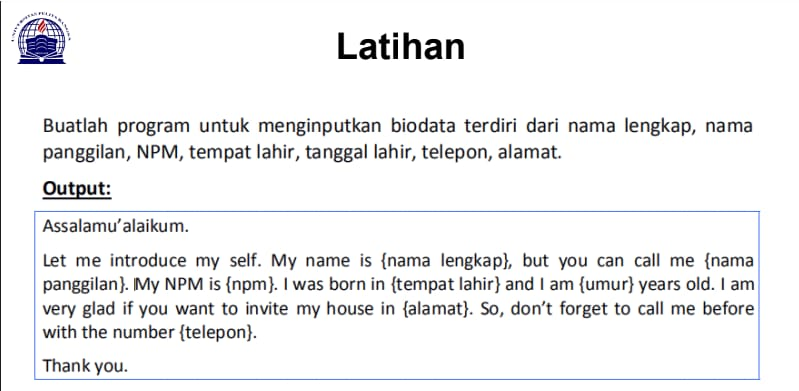
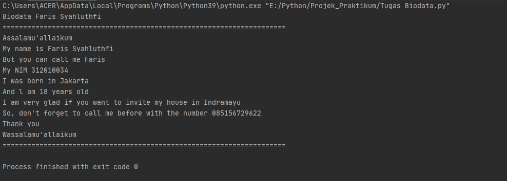
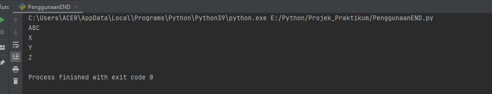
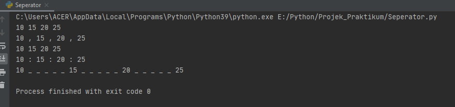

# Tugas ini untuk melengkapi pertemuan ke 6 <br>
# Dan menjelaskan project <br>


**Nama : Faris Syahluthfi** <br>
**Nim  : 312010034** <br>
**Kelas: TI.A1.20** <br>
**Tugas: Bahasa Pemrogramman** <br>

DAFTAR ISI
| No | Description | Link |
| ----- | ----- | ----- |
| 1 | Tugas Pertemuan 5 | [click here](#pertemuan-5---tugas)
| 2 | Tugas Pertemuan 6 - Lab 1 | [click here](#pertemuan-6---lab-1)
| 3 | Tugas Pertemuan 6 - Lab 1 dan 2 | [click here](#pertemuan-6---lab-1-2)
 
## Pertemuan 5 - Tugas

Pada pertemuan 5 Bahasa Pemrograman saya diberi tugas oleh Dosen untuk membuat Biodata Diri menggunakan Aplikasi Python Berikut dibawah ini contoh soalnya: <br>
 <br>
Saat ini saya akan menjelaskan hasil dari tugas tersebut. <br>
Berikut *source code* nya atau Klik Link berikut ([pertemuan5 python](pertemuan5.py)): <br>
```python <br>
print ("Biodata Faris Syahluthfi")
print ("=====================================================================")
print ("Assalamu'allaikum")
print ("My name is Faris Syahluthfi")
print ("But you can call me Faris")
print ("My NIM 312010034")
print ("I was born in Jakarta")
print ("And l am 18 years old")
print ("I am very glad if you want to invite my house in Indramayu")
print ("So, don't forget to call me before with the number 085156729622")
print ("Thank you")
print ("Wassalamu'allaikum")
print ("=====================================================================")

 <br>

```
Berikut Penjelasannya :<br>
```python <br>
print("please enter your full name : ") <br>
``` <br>
Source code diatas berfungsi untuk mencetak hasil / output berupa **My name is Faris Syahluthfi** ". <br>
 Untuk menampilkan output string, saya menggunakan *tanda petik dua* didalam fungsi print(), sedangkan jika saya ingin menampilkan output atau hasil berupa angka atau interger saya tidak perlu menggunakan *tanda petik dua*. Contohnya : <br>

```python

print("My name is....") <br>
print(My NIM 1234567) <br>
```
(Seperti gambar dibawah ini) <br> 



## Pertemuan 6 - Lab 1

Pada pertemuan ke 6 saya diberikan tugas oleh Dosen yaitu untuk mempelajari operator aritmatika menggunakan bahasa Pemrograman pyhton. Berikut ini adalah source code yang di berikan oleh dosen : <br>

``` python

# Penggunaan end

print ('A', end='')
print('B', end='')
print('C', end='')
print()
print('X')
print('Y')
print('Z')

# Penggunaan separator
w, x, y, z = 10, 15, 20, 25
print(w, x, y, z)
print(w,x, y, z,  sep=' , ')
print(w,x, y, z,  sep=' ')
print(w,x, y, z,  sep=' : ')
print(w,x, y, z,  sep=' _ _ _ _ _ ')


```

Oke, kali ini saya akan menjelaskan tentang materi yang di berikan oleh Dosen.<br>

* Penggunaan END
Penggunaan end digunakan untuk menambahkan karakter yang dicetak di akhir baris. secara default penggunaan end adalah untuk ganti baris. <br>

``` python

print ('A', end='')
print('B', end='')
print('C', end='')

```

`> Penggunaan print () digunakan untuk mencetak output, seperti syntax dibawah ini :`

``` python

`print()`

```

`>Syntax dibawah ini digunakan untuk menampilkan output berupa string`

``` python

print('X')
print('Y')
print('Z')

```

Hasil dari source code tersebut seperti gambar dibawah ini :<br>



* Penggunaan separator

`>Pendeklarasian beberapa variable beserta nilainya`

``` python

w,x,y,z=10,15,20,25

```

`>Menampilkan hasil dari variable tiap-tiap variable`

``` python

print(w,x,y,z)

```

`>Menampilkan hasil dari tiap-tiap variable dengan menggunakan pemisah : (koma)`

``` python

print(w, x, y, z, sep=",")

```

`>Menampilkan hasil dari tiap-tiap variable dengan menggunakan pemisah`

``` python

print(w, x, y, z, sep="")

```

`>Menampilkan hasil dari tiap-tiap variable dengan menggunakan pemisah : (titik dua)`

``` python

print(w, x, y, z, sep=" : ")

```

`>Menampilkan hasil dari tiap-tiap variable dengan menggunakan pemisah`

-----

``` python

print(w, x, y, z, sep=" _ _ _ _ _ ")

```

* Output dari syntax / source code diatas adalah seperti berikut ini : <br>




<br>
<hr>
<br>

## Pertemuan 6 - Lab 1-2

* String Format<br>
String formatting atau pemformatan string memungkinan kita menyuntikkan item kedalam string dari pada kita mencoba menggabungkan string menggunakan koma atau string concatenation.<br>

* Penggunaan source code yang di berikan oleh dosen seperti berikut : <br>

 <br>

``` python

#string format 1
print(0, 10**0)
print(1, 10**1)
print(2, 10**2)
print(3, 10**3)
print(4, 10**4)
print(5, 10**5)
print(6, 10**5)
print(8, 10**8)
print(9, 10**9)
print(10, 10**10)

#string format 1
print('{0:>3} {1:>16}'.format(0, 10**0))
print('{0:>3} {1:>16}'.format(1, 10**1))
print('{0:>3} {1:>16}'.format(2, 10**2))
print('{0:>3} {1:>16}'.format(3, 10**3))
print('{0:>3} {1:>16}'.format(4, 10**4))
print('{0:>3} {1:>16}'.format(5, 10**5))
print('{0:>3} {1:>16}'.format(6, 10**6))
print('{0:>3} {1:>16}'.format(7, 10**7))
print('{0:>3} {1:>16}'.format(8, 10**8))
print('{0:>3} {1:>16}'.format(9, 10**9))
print('{0:>3} {1:>16}'.format(10, 10**10))

```

<br>
Saat ini saya akan membahas satu persatu dari syntax yang telah diberikan oleh Dosen.<br>

1. **String Format 1** <br>
Pada syntax / source code strring format satu akan menampilkan output berupa 2 outputan.<br>
Yang pertama (sebelah kiri) akan menampilkan angka urut dari angka 0 hingga 10, sedangkan untuk sebelah kanan akan menampilkan Operasi Aritmatika Pangkat.<br> 
Dengan ketentuan sebagai berikut, Operasi pangkat dengan angka kiri sebagai pokok (Rumus : ** [bintang dua] )<br>
 Hasil dari syntax tersebut adalah 10 pangkat 0, hingga 10 pangkat 10, dengan output  sebagai berikut : <br>

 
 
 2 ** String Format 2** <br>
 Pada syntax atau source code string format dua akan menampilkan output berupa 2 output'an juga (seperti String Format 1, yaitu kanan dan kiri )<br>
 Dengan ketentuan sebagai berikut : <br>
 >secara Default, **.format()** menggunakan rata kiri, angka ke kanan. kita dapat menggunakan opsi opsional <,^, atau > untuk mengatur perataan kiri, tengah, atau kanan. Contoh lain dalam penggunaan **.format()** sebagai berikut :<br> 

 ``` python

`print('{0:8} | {1:9}'.format('Nama orang','Jumlah'))`
`print('{0:8} | {1:9}'.format('Alek',3.))`
`print('{0:8} | {1:9}'.format('Jony',10))`

```

Hasil dari source code contoh diatas akan seperti berikut :<br>

>Secara Default,**.format()** menggunakan rata text ke kiri, angka ke kanan, kita dapat menggunakan opsi opsional<,^,atau > untuk mengatur perataan kiri, tengah, atau kanan. Contoh lain dalam penggunaan **.format()** sebagai berikut : <br>

``` python

`print('{:<30}{:30}{:>30}'.format('kiri','tengah','kanan'))`
`print('{:<30}{:30}{:>30}'.format(7,20,34))`

```

Hasil dari source code contoh diatas akan muncul seperti ini :<br>

<br><br>

String Format


Untuk hasil dari String Format 2 adalah :<br>


<br><hr><br>

# Pengertian print <br>

`print` <br>

* print("Tugas ini untuk melengkapi pertemuan 6") <br>

 <br>

* Menampilkan hasil print<br>

 <br>

Contoh syntax variabel : <br>


**TERIMA KASIH** <br>


